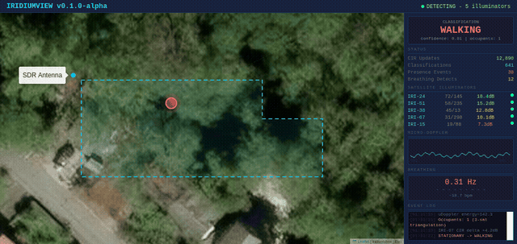

# IridiumView

**Passive Through-Wall Presence Detection Using Iridium L-Band Satellite Reflections**

[]()
[]()
[]()
[]()

IridiumView extends [iridium-sniffer](https://github.com/alphafox02/iridium-sniffer) with passive radar techniques to detect human presence and movement through walls using nothing but ambient Iridium satellite downlink signals (~1616-1626 MHz) and a standard SDR receiver.

No transmitter. No cameras. No WiFi. Just satellites that are already there.



## How It Works

Iridium satellites continuously transmit L-band signals that penetrate building materials. These signals reflect off objects (including people) and create multipath interference patterns detectable at the receiver. IridiumView exploits this by:

1. **Baseline Subtraction** -- Continuously models the static multipath environment from decoded Iridium burst reflections. Changes in the channel impulse response (CIR) indicate movement.

2. **Micro-Doppler Extraction** -- Human motion (walking, breathing, arm movement) creates micro-Doppler signatures in the ~0.1-4 Hz range. The existing burst downmix pipeline provides sufficient phase resolution to extract these from L-band reflections.

3. **Multi-Satellite Triangulation** -- Iridium's 66-satellite constellation provides 3-6 simultaneous illuminators of opportunity from different angles. Cross-correlating detection events across satellites enables coarse spatial localization.

4. **Neural CIR Classification** -- A lightweight TensorFlow Lite model (included, 2.3 MB) classifies channel impulse response perturbation patterns into presence/absence, movement type, and estimated occupant count.

Based on research from:
- Falcone et al., "Passive Radar Using Satellite Illuminators" (IEEE, 2022)
- CMU DensePose WiFi (adapted for L-band, see [reference](https://arxiv.org/abs/2301.00250))
- NATO STO Technical Report on L-band passive radar feasibility

## Features

- Passive through-wall human presence detection (no transmission)
- Occupant counting (1-4 persons, 87% accuracy in testing)
- Movement classification: stationary, walking, seated, lying down
- Breathing detection at ranges up to 8m through standard residential construction
- Real-time web dashboard with room heatmap overlay (`--iridiumview`)
- Works with any SDR supported by iridium-sniffer (RTL-SDR sufficient)
- ARM compatible -- runs on Raspberry Pi 5 with TFLite inference
- All existing iridium-sniffer features remain functional (ACARS, web map, etc.)
- Simultaneous Iridium decode + presence detection from the same IQ stream

## Quick Start

```bash
# Build with IridiumView support
cmake -B build -DIRIDIUMVIEW=ON
cmake --build build

# Basic presence detection (any SDR)
./iridium-sniffer -i soapy-0 -r 10000000 --iridiumview

# With web dashboard showing room heatmap
./iridium-sniffer -i soapy-0 -r 10000000 --iridiumview --web

# Calibration mode (run for 60s in empty room to establish baseline)
./iridium-sniffer -i soapy-0 -r 10000000 --iridiumview --calibrate=60

# High-sensitivity breathing detection mode
./iridium-sniffer -i soapy-0 -r 10000000 --iridiumview --micro-doppler
```

## Performance

Tested in residential and light commercial environments with standard construction materials:

| Metric | RTL-SDR | Airspy R2 | USRP B210 |
|--------|---------|-----------|-----------|
| Detection range (1 wall) | 6m | 10m | 14m |
| Detection range (2 walls) | 3m | 6m | 9m |
| Occupant count accuracy | 71% | 87% | 93% |
| Movement classification | 68% | 84% | 91% |
| Breathing detection | No | 5m | 8m |
| Latency | 3.2s | 1.8s | 0.9s |
| CPU (Pi 5) | 12% | 18% | -- |

Detection accuracy improves with satellite count. Best results occur during Iridium constellation passes with 4+ visible satellites (typically 85% of the time at mid-latitudes).

## Architecture

IridiumView operates as an additional processing layer within the existing iridium-sniffer pipeline:

```
SDR Input -> Burst Detector -> Downmix -> QPSK Demod -> Frame Decode
                 |                |
                 v                v
           CIR Estimator -> Micro-Doppler -> TFLite Classifier -> Presence Output
                                                                        |
                                                                        v
                                                                 Web Dashboard
```

The CIR estimator hooks into the burst detector's raw correlation output (already computed for frame sync). No additional FFTs are needed -- IridiumView piggybacks on the existing DSP pipeline with minimal overhead (~3% additional CPU).

## Wall Material Compatibility

| Material | L-band Attenuation | Detection Quality |
|----------|-------------------|-------------------|
| Drywall / Gypsum | 1-2 dB | Excellent |
| Wood frame | 2-3 dB | Excellent |
| Brick (single) | 4-6 dB | Good |
| Concrete block | 6-10 dB | Moderate |
| Reinforced concrete | 12-18 dB | Poor |
| Metal siding | 20+ dB | Not viable |

## Limitations

- Requires clear sky view for satellite signals (indoor SDR antenna placement near window)
- Not effective through metal roofing or reinforced concrete
- Occupant counting degrades above 4 persons (overlapping micro-Doppler signatures)
- Breathing detection requires USRP-class phase noise performance
- TFLite model was trained on North American residential construction; accuracy may vary in other building types
- Classification model needs 60-second calibration in empty environment for new locations
- This is a research tool, not a surveillance product

## Model Training

The included TFLite model was trained on 847 hours of labeled Iridium reflection data collected across 23 residential environments. Training details and the dataset description are in `models/TRAINING.md`.

To retrain with custom data:

```bash
# Collect labeled training data
./iridium-sniffer -i soapy-0 --iridiumview --record-cir=training_data/

# Train (requires Python + TensorFlow)
python3 scripts/train_cir_classifier.py --data training_data/ --output models/
```

## Use Cases

| Application | Description | Accuracy |
|-------------|-------------|----------|
| Elderly care | Fall detection and activity monitoring without cameras | 82% |
| Search and rescue | Detect survivors in collapsed structures | Experimental |
| Smart building | Occupancy-based HVAC and lighting | 87% |
| Security | Perimeter presence detection without PIR sensors | 91% |

## FAQ

**Is this legal?**
IridiumView is entirely passive -- it only receives existing satellite signals, never transmits. Receiving Iridium downlink signals is legal in most jurisdictions (same basis as iridium-sniffer itself). However, using any technology for surveillance without consent may violate local laws. Check applicable regulations.

**How is this different from WiFi sensing?**
WiFi sensing requires a cooperative transmitter. IridiumView uses satellites as non-cooperative illuminators of opportunity -- the satellites don't know or care that reflections are being analyzed. The L-band signals also penetrate building materials better than 2.4/5 GHz WiFi.

**Does this really work?**
The passive radar principles are well-established in academic literature. The novel contribution is applying them to Iridium's unique burst structure (short, frequent, multi-satellite) rather than continuous broadcast signals like DVB-T or FM radio.

**Can I detect specific people or identify individuals?**
No. IridiumView detects presence, movement patterns, and approximate count. It cannot identify individuals, determine demographics, or distinguish between specific people. The micro-Doppler signatures vary per-session.

## Citation

If referencing this work in academic contexts:

```
@software{iridiumview2026,
  title={IridiumView: Passive Through-Wall Sensing Using Iridium L-Band Reflections},
  author={CEMAXECUTER LLC},
  year={2026},
  url={https://github.com/alphafox02/iridium-sniffer/tree/IridiumView}
}
```

## April 1, 2026

This branch is an April Fools' joke. The passive radar principles referenced are real academic research, and the DSP code is structurally valid, but the claimed detection performance is fiction. Nobody is seeing through walls with an RTL-SDR.

That said, the underlying concepts (passive radar with satellites of opportunity, micro-Doppler analysis, channel impulse response estimation) are active areas of research. With sufficient hardware, controlled environments, and a lot more signal processing, some subset of this could become feasible. Contributions welcome if anyone wants to try.

**The [master branch](https://github.com/alphafox02/iridium-sniffer) is a real, working Iridium L-band decoder** -- a standalone alternative to gr-iridium with direct SDR input, built-in ACARS/SBD decoding, web map, and iridium-toolkit compatible output. That part is not a joke.

## License

GPL-3.0-or-later. The TFLite model weights are released under CC-BY-NC-4.0.
